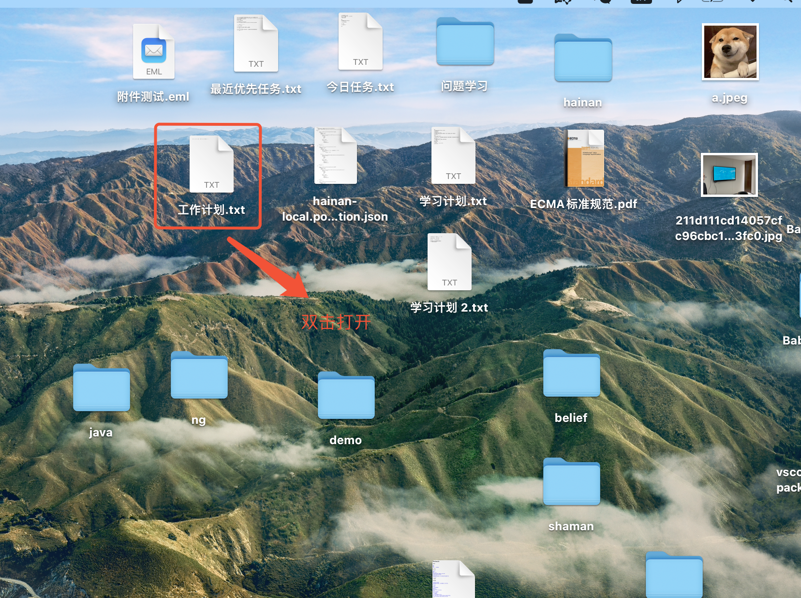
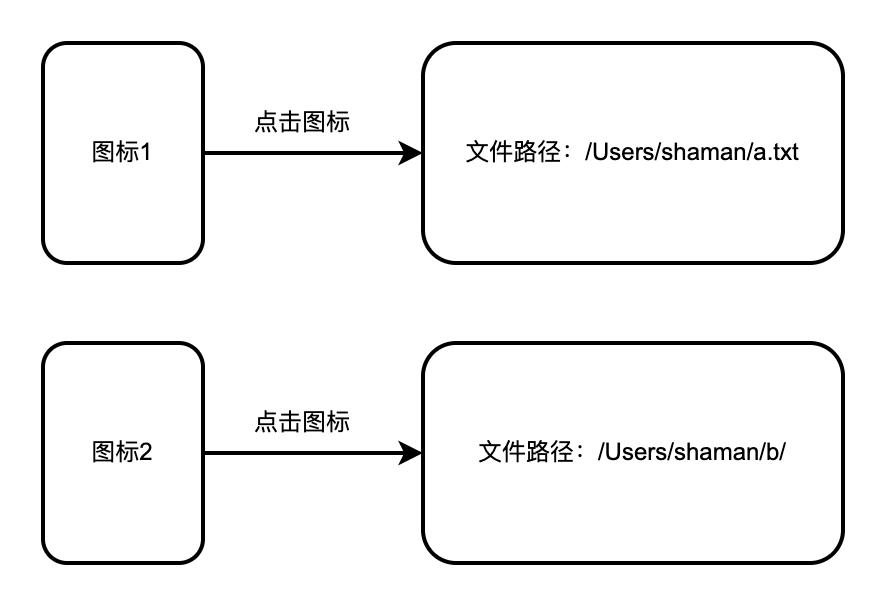
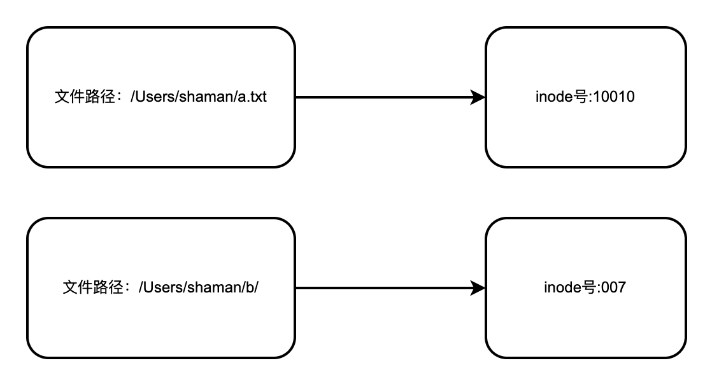

# inode
## 什么是inode？
::: info
`inode`（索引节点）是UNIX和类UNIX文件系统（如Linux）中的一个基本概念。它是文件系统的一个数据结构，用于存储有关文件的元数据，但不包含文件名或文件实际内容。每个文件或目录在文件系统中都有一个与之对应的唯一的inode。

每个inode都有一个唯一的编号（inode号）。当需要访问一个文件时，文件系统首先根据文件名找到相应的目录项（directory entry），该目录项包含文件的inode号。然后，通过inode号读取inode信息，从而得到文件的元数据和存储位置。

inode的设计使得UNIX和类UNIX文件系统能够高效地管理和访问文件和目录。例如，由于文件名不存储在inode中，可以实现硬链接，即多个文件名指向同一个inode，从而指向相同的文件内容。
:::

## inode数据结构
::: info
在UNIX和类UNIX系统（如Linux）中，inode（索引节点）是文件系统的一个关键数据结构，用于存储有关文件的元数据。每个inode结构块通常包含以下信息：

1.**文件类型**：指明文件是常规文件、目录、符号链接、字符设备、块设备、FIFO（命名管道），等等。

2.**权限**：文件的访问权限，包括读（r）、写（w）和执行（x）权限，分别针对文件所有者、所属组和其他用户。

3.**所有者**：文件所有者的用户ID（UID）。

4.**群组**：文件所属群组的群组ID（GID）。

5.**大小**：文件的大小，通常以字节为单位。

6.**时间戳**：文件的三个时间戳
- **i_atime（访问时间）**：文件最后一次被访问的时间。
- **i_mtime（修改时间）**：文件内容最后一次被修改的时间。
- **i_ctime（状态改变时间）**：文件的状态（例如权限或所有权）最后一次被改变的时间。

7.**链接计数**：文件的硬链接数量。当这个计数减少到0时，文件被删除。

8.**数据块指针**：指向文件系统中存储文件内容的数据块的指针。这些指针包括直接指针、间接指针、二级间接指针和三级间接指针。

9.**文件系统特定信息**：比如块大小、分配给文件的实际数据块数量等。

10.**扩展属性**：一些文件系统可能支持额外的扩展属性，如安全标签、ACL（访问控制列表）等。

inode结构的具体内容和格式可能会根据不同的文件系统有所不同，但基本包含的信息是类似的。这些信息使得文件系统能够有效地管理文件的存储、访问和权限控制。
:::

> [linux 内核 inode数据结构 打开后搜索inode](https://git.kernel.org/pub/scm/linux/kernel/git/stable/linux.git/tree/include/linux/fs.h?h=v6.6.8)
## 1.操作系统中是如何查找inode号的？
::: info
在操作系统中，尤其是基于类Unix（如Linux）的系统中，桌面上的文件是通过路径找到与之对应的inode（索引节点）信息的。inode是文件系统的一个概念，用于存储有关文件的元数据，不包括文件名或文件实际内容的数据。文件的元数据包括文件的大小、权限、所有者、创建时间、修改时间等信息。

当您在文件系统中访问一个文件时（无论是在桌面环境还是命令行），以下步骤大致发生：

- 1.路径解析：操作系统解析您提供的文件路径，这可能是绝对路径或相对路径。

- 2.查找目录项：在文件系统中，每个文件和目录都有一个目录项（directory entry）。目录项将文件名映射到相应的inode。

- 3.访问inode：一旦找到了与文件名对应的目录项，系统就会使用这个目录项来获取inode号。每个inode号都唯一地标识文件系统中的一个文件或目录。

- 4.读取inode信息：系统接着读取inode，这包含了文件的元数据，如大小、权限等。

- 5.访问文件数据：根据inode中的信息，系统可以找到文件数据实际存储在磁盘上的位置，并进行读取或写入操作。

在一些其他类型的文件系统（如Windows上的NTFS）中，虽然具体的实现细节和术语可能有所不同，但基本的原理是相似的，即通过文件路径来查找和访问文件的元数据和内容。
:::

## 2.桌面上的文件和路径信息是如何绑定的，如何双击后就知道路径的？
::: info
桌面上的文件和其路径信息的绑定是由操作系统的桌面环境（例如Windows的资源管理器，macOS的Finder，或Linux的各种桌面环境如GNOME, KDE等）管理的。这个过程大致如下：

- 1.文件存储：文件实际上存储在文件系统的某个位置，如 /Users/username/Desktop 在 macOS 或 C:\Users\username\Desktop 在 Windows 上。

- 2.桌面环境：桌面环境负责显示桌面上的文件和文件夹。它读取特定的桌面路径（如上述路径），并将该路径下的每个文件和文件夹呈现为图标。

- 3.图标和文件的映射：每个图标都是对应文件或文件夹的视觉代表。桌面环境维护了一个映射，把每个图标与其对应的文件系统路径（文件的绝对路径）关联起来。

- 4.用户交互：当您双击桌面上的文件图标时，桌面环境接收到这个事件，并查找与该图标关联的文件路径。

- 5.打开文件：桌面环境使用这个路径信息来打开文件。这通常涉及调用与文件类型关联的应用程序。例如，双击一个 .txt 文件会打开文本编辑器，双击 .jpg 图像文件通常会打开图像查看器。

应用程序与文件交互：启动的应用程序会接收到文件的路径，并使用它来直接从文件系统中加载文件内容。

这个过程使得用户界面（如桌面）可以为用户提供一个直观的方式来与存储在文件系统某个地方的文件交互。操作系统和桌面环境的这种设计抽象掉了底层文件系统的复杂性，使得用户可以通过简单的图形界面与文件交互。
:::

## 图例理解
### 1.电脑打开某个文件（用户界面）

### 2.点击图标从系统记录的图标和路径的映射表中获取其路径

### 3.根据路径在系统中的路径与inode映射表中找到对应的inode号

