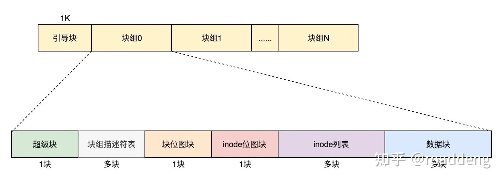

# 文件系统的数据结构

下面图片引自知乎[文件系统-inode](https://zhuanlan.zhihu.com/p/655508477) , 侵删

- 引导块：通常位于文件系统的开始位置，包含了启动文件系统所需的引导加载程序。

- 超级块：存储了文件系统的整体信息，如块大小、inode数量、块数量、空闲块和inode的数量等。

- 块组描述符：在某些文件系统（如ext系列）中，描述了块组的状态，如空闲块的数量、空闲inode的数量等。

- 块位图（block bitmap）：表示哪些数据块是已使用的，哪些是空闲的。

- inode位图（inode bitmap）：表示哪些inode是已使用的，哪些是空闲的。

- inode表 (inode table)：包含了文件系统中所有文件的inode信息，每个inode对应一个文件或目录。

- 数据块（datablock）：实际存储文件数据的区域。

