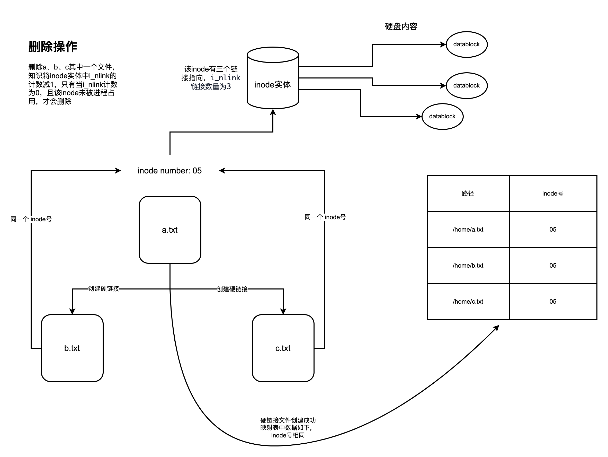

# 硬链接
## 1.什么是硬链接
硬链接（Hard Link）是Unix和类Unix操作系统中的一种文件系统机制，它允许一个文件系统中的多个文件名指向同一个文件(相同内容或者说相同数据块)。硬链接提供了不同路径或名称访问相同文件内容的方式。
## 2.硬链接的特点
- **Inode引用**：硬链接直接指向文件的inode（索引节点）。inode包含了文件的元数据和数据块地址。在文件系统中，多个硬链接可以共享同一个inode号。
- **文件内容共享**：所有硬链接到同一inode的文件共享相同的文件内容和属性（如大小、权限等）。对其中任何一个链接的内容修改都会反映在所有链接中。
- **计数器**：每个inode都有一个链接计数器，表示有多少硬链接指向该inode。当创建一个新的硬链接时，inode的链接计数器增加；当删除一个链接时，计数器减少。只有当链接计数器降到0时，文件的数据才会被文件系统释放。
- **不跨越文件系统**：硬链接不能跨越不同的文件系统，因为每个文件系统都有独立的inode表。
- **不可链接目录**：大多数Unix和类Unix系统不允许对目录创建硬链接，以避免产生循环引用和其他复杂情况

::: tip
硬链接不可链接目录的原因
```bash
/
├── dir1
│   └── link_to_dir2 -> /dir2
└── dir2
    └── link_to_dir1 -> /dir1
```
在这种配置下，dir1 包含了一个指向 dir2 的链接，而 dir2 又包含了一个指向 dir1 的链接。这就形成了一个循环，如果文件系统的工具（如 ls, find 等）不特别处理这种情况，就会陷入无限循环，尝试遍历一个看似永无止境的目录结构。
:::
## 3.创建硬链接
在Linux或Unix系统中，可以使用ln命令创建硬链接：
```bash
ln source_file link_name
```
## 4.硬链接和inode
- **共享相同的inode**：硬链接指向文件的inode。如果一个文件有多个硬链接，这些链接共享同一个inode号。这意味着它们指向同一个文件的数据和元数据。

- **链接计数**：每个inode有一个链接计数，表明有多少硬链接指向这个inode。当创建一个新的硬链接时，inode的链接计数增加；删除一个硬链接时，计数减少。只有当链接计数降至零时，文件系统才会释放该inode及其关联的数据块。

- **文件的物理数据**：由于所有硬链接共享同一个inode，它们也共享文件的物理数据。对文件内容的任何修改都会反映在所有的硬链接上。

- **不同于软链接**：硬链接与软链接（符号链接）不同。软链接是一个单独的文件，包含一个指向另一个文件路径的文本字符串。软链接有自己的inode，而硬链接共享其目标文件的inode。

- **文件删除**：只有当一个文件的所有硬链接都被删除，且没有任何进程打开该文件时，文件的数据才会被实际删除。

::: tip
软链接可以跨文件系统，而硬链接不能，这主要是由于它们各自的工作方式和存储机制所决定的：

**软链接（符号链接）**
- 路径引用：软链接通过存储目标文件或目录的路径来工作。它实际上是一个特殊的文件，其中包含了指向另一个文件或目录的路径字符串。
- 独立性：由于软链接仅保存路径信息，它们与文件数据的实际存储位置无关。因此，软链接可以引用任何文件系统上的文件或目录，无论目标文件所在的文件系统与软链接所在的文件系统是否相同。
- 文件系统边界：软链接可以指向不同文件系统上的文件或目录，因为它们依赖于路径信息，而非直接链接到文件数据。

**硬链接**
- Inode引用：硬链接直接指向目标文件的inode（索引节点）。在Unix和类Unix系统中，inode是文件系统中的一个数据结构，用于存储文件的元数据和指向文件实际数据的指针。
- 同一文件系统限制：由于硬链接是对inode的直接引用，它们必须位于同一个文件系统中。不同的文件系统有不同的inode表，一个文件系统中的inode号在另一个文件系统中可能不存在或指向不同的文件。
- 不跨越文件系统：硬链接不能跨越文件系统边界，因为每个文件系统都有独立的inode管理机制。

**结论**

软链接的灵活性在于它仅仅保存了指向目标文件的路径信息，而与文件的实际存储无关，因此可以跨越文件系统边界。

硬链接的限制在于它直接引用了文件的inode，而inode是特定于文件系统的，这意味着硬链接不能链接到其他文件系统中的文件。
:::

## 图例
