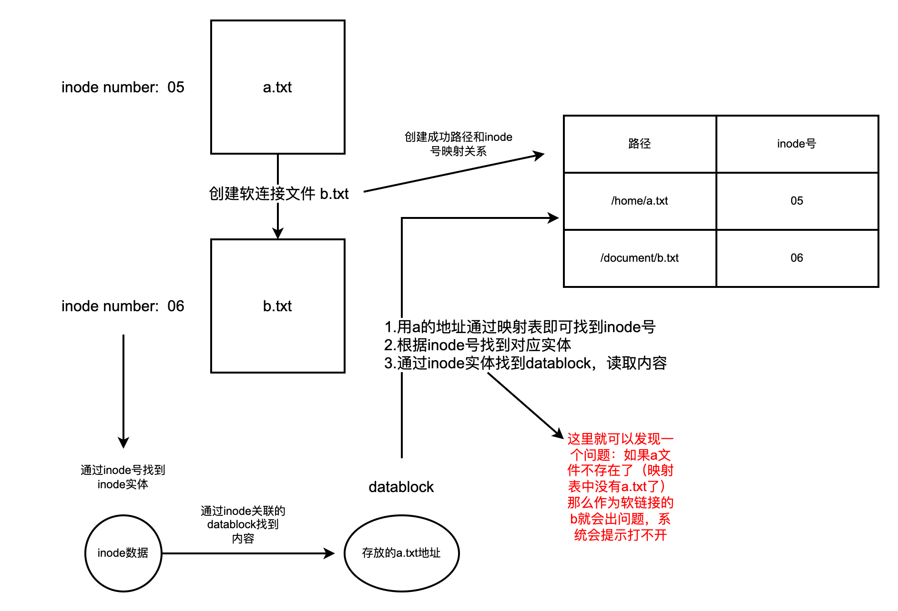

# 软链接
## 1.什么是软链接
软链接（也称为符号链接或符号性链接），在Unix和类Unix操作系统中，是一种特殊类型的文件，它作为对另一个文件或目录的引用或路径。软链接可以看作是一个指向另一个文件或目录的快捷方式。

## 2.软链接的特点
- **路径引用**：软链接包含了目标文件或目录的路径。当访问软链接时，操作系统会沿着这个路径定位到目标。
不同于硬链接：与硬链接不同，软链接并不直接指向文件数据的inode，而是指向另一个文件或目录的路径。因此，软链接可以跨文件系统，而硬链接不能。
- **大小**：软链接文件的大小通常是它所指向的路径的字符数。
- **删除和移动**：删除或移动目标文件会导致软链接失效，因为链接的路径不再指向有效的位置。
- **权限**：软链接的权限通常是lrwxrwxrwx（即所有用户都有读、写、执行权限），但实际上软链接的权限并不重要，因为系统会使用目标文件的权限。

## 3.创建软链接
在Linux或Unix系统中，可以使用ln命令的-s选项创建软链接：
```bash
ln -s target_path link_name
```

## 4.软链接和inode
- **独立的inode**：软链接有自己的inode，这个inode与它所指向的文件的inode是完全独立的。
- **指向路径，非inode**：软链接的inode存储的信息表示一个路径，当访问软链接时，文件系统解析这个路径来找到目标文件。目标文件是由其自己的inode表示的。
- **目标文件的改变**：如果软链接指向的目标文件被移动或删除，软链接的inode不变，但链接会变成“死链接”（broken link），因为存储在其数据块中的路径不再指向一个有效的位置。
::: tip
软链接的存放目标地址不是存放在inode结构中，存放在其所指向的数据块中
:::

## 图例
<!--  -->
文件a -> 创建软连接b, 点击b -> 找到a
